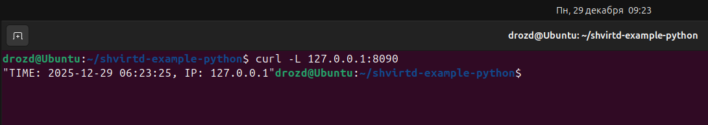
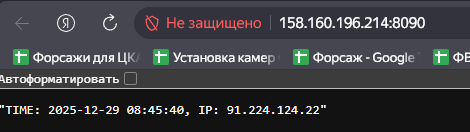
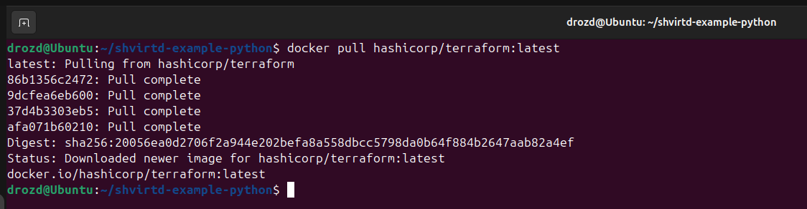
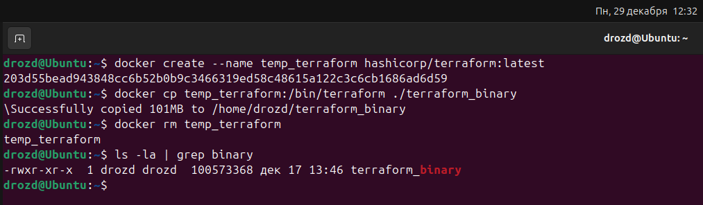
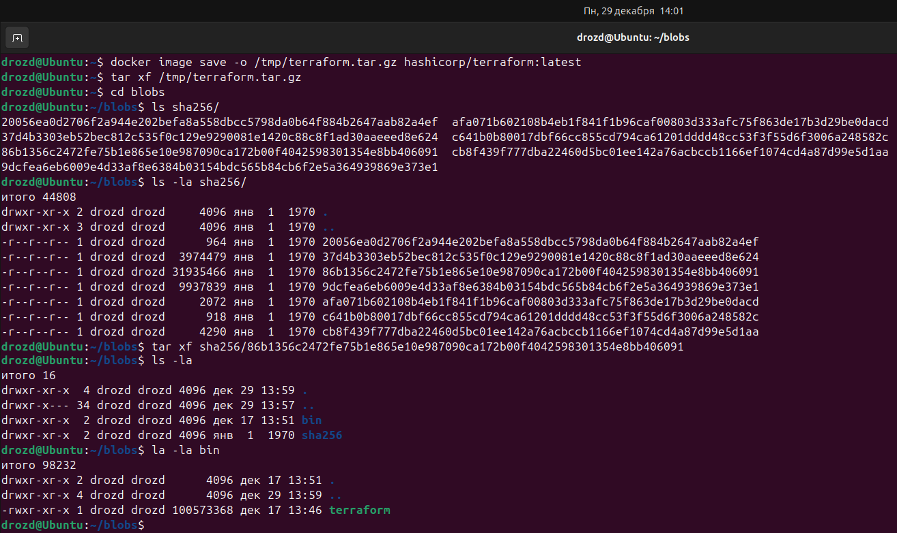

### Сканирование в Yandex Cloud.

### Проверка работоспособности.

### Проверка на удаленном хосте.

[Репозиторий](https://github.com/VeselijDrozd/shvirtd-example-python.git)

[Скрипт](./scripts/deploy.sh)

Я не смог разобраться с одной проблемой. После запуска всех контейнеров при первом обращении к БД приложение не создает таблицу. В логах указывает на отсутствие таблицы только в первый запрос, последующие молча возвращает код HTTP 200. Первое, на что подумал - база данных не успевает запуститься. Давал больше времени, проверил depends_on - ни в какую. Лечится перезапуском контейнера с приложением. После перезапуска даже без ожидания сразу выдает нормальный результат. Я так и не смог это вылечить, добавил в скрипт ручной перезапуск. Я буду очень признателен, если вы откроете мне эту загадку.

---

### Docker cp

Создал временный контейнер и от туда стянул бинарник.

### Dive и Docker save

Тут у меня снова возникли загадки. Я вроде сделал все как в лекции:
- с помощью dive нашел слой с копированием /bin/terraform и взял от туда хэш слоя.
- сохранил образ в архив, извлек его и обнаружил другие хэши...

Я, конечно, по размеру директорий смог найти нужный и достать от туда бинарник, но это все равно не дает мне покоя.

---

Мне очень жаль, что до НГ не успел, очень сильно завис с вопросом взаимодейтсвия приложения с БД и так и не справился. Времени на сайд-квесты не осталось, но я улучу момент и обязательно сделаю.
Желаю всей команде Нетологии веселых праздников.
